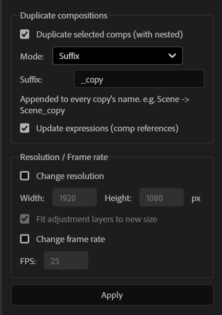

# Recomp

A free After Effects script to **duplicate compositions** — together with all their nested comps and expression links — and/or **batch-change resolution and frame rate** across a whole comp tree.

Think of it as a lightweight, focused take on the classic "duplicate the entire comp hierarchy" workflow, with a couple of extra tricks: smart naming, optional resolution/FPS changes, and proper handling of adjustment layers when you resize.

<p align="center">
  
</p>

<p align="center">
  
</p>

---

## Features

- **Deep duplication** — duplicates the selected comp(s) and every nested sub-comp, recursively.
- **Smart deduplication** — if a sub-comp is used in several places, it is duplicated only once and every reference points to that single copy (no orphan duplicates).
- **Expression-aware** — `comp("OriginalName")` references inside expressions are rewritten to point at the new copies, so cross-comp links keep working.
- **Three naming modes:**
  - **Suffix** — append text to each name (`Scene` → `Scene_copy`).
  - **Increment number** — bump the last number in the name (`Scene_01` → `Scene_02`).
  - **Full rename** — give the top comp a brand-new name; nested comps become `Name 1`, `Name 2`, …
- **Batch resolution change** — set a new width/height in pixels for every comp in the tree.
- **Adjustment-layer refit** — when resizing, solid-based adjustment layers get a fresh comp-sized source (scale 100%, centered) — exactly like creating a new adjustment layer in the resized comp, instead of stretching the old one.
- **Keep content centered** — when resizing, the composition is kept centered (like the *Anchor: center* option in Composition Settings) instead of sticking to the top-left corner. Works with static and animated positions.
- **Batch frame-rate change** — set a new FPS (supports fractional rates like 23.976 / 29.97).
- **Mix and match** — every action is a checkbox. Duplicate only, resize only, change FPS only, or any combination. With duplication off, changes are applied in-place to the selected comps and their nested comps.
- **Single undo** — the whole operation is one undo step.

---

## Requirements

- Adobe After Effects **2021 (v18) or newer** — tested through the latest release.
- Windows or macOS.

---

## Installation

Recomp is a `ScriptUI` panel, so it lives in the **ScriptUI Panels** folder and shows up in the **Window** menu.

### Windows

1. Download `Recomp.jsx` from the [latest release](../../releases) (or from this repo).
2. Copy it into:
   ```
   C:\Program Files\Adobe\Adobe After Effects <version>\Support Files\Scripts\ScriptUI Panels\
   ```
   (Replace `<version>` with your install, e.g. `2026`.)
3. Restart After Effects.

### macOS

1. Download `Recomp.jsx`.
2. Copy it into:
   ```
   /Applications/Adobe After Effects <version>/Scripts/ScriptUI Panels/
   ```
3. Restart After Effects.

### One-time setting

Go to **Preferences → Scripting & Expressions** and enable **Allow Scripts to Write Files and Access Network**. This lets the panel modify expressions. (After Effects may also ask you to confirm this the first time.)

### No admin rights? (run it without installing)

You can run Recomp without copying it into Program Files:

- **File → Scripts → Run Script File…** and pick `Recomp.jsx`.

It will open as a floating window for that session.

---

## Usage

1. In the **Project** panel, select one or more compositions.
2. Open **Window → Recomp.jsx**.
3. Tick what you want:
   - **Duplicate compositions** — on for copies, off to edit the selected comps in place.
   - **Change resolution** — enter width/height; optionally keep **Fit adjustment layers** and **Keep content centered** on.
   - **Change frame rate** — enter the new FPS.
4. Click **Apply**.

The order of operations is always: duplicate → fix expressions → resolution + adjustment refit → frame rate.

---

## Notes & limitations

- **Layers are not scaled** on a resolution change — only the comp canvas size changes. Recomp deliberately doesn't stretch your content; it just gives you the new canvas (and refits full-frame adjustment layers). With **Keep content centered** on, layers are shifted so the composition stays centered; layers driven by a position *expression* are left untouched.
- **Footage and solids are not duplicated** — copies share the original footage/solids, which is the usual expectation. Adjustment-layer refitting creates *new* solids, so your originals are never altered.
- **Expression remapping** matches `comp("Name")` by name. If two different comps share the exact same name, the first match wins (a limitation of name-based lookup).
- **Frame-rate change** keeps comp duration in seconds; keyframes stay on their timecode, so their frame numbers may shift.
- Animated or expression-driven transforms on adjustment layers are left untouched (only their source is refit), to avoid breaking existing animation.

---

## Contributing

Issues and pull requests are welcome. If you hit a bug, please include your AE version, OS, and a short description of the comp setup.

---

## License

[MIT](LICENSE) — free to use, modify, and share. Attribution appreciated but not required.

---

## Author

Made by **Denis Petriaev** — motion designer & 3D artist.

- Behance: https://www.behance.net/petryaev_art
- Instagram: https://www.instagram.com/petryaev_art/
- LinkedIn: https://www.linkedin.com/in/dpetryaev/

If Recomp saves you time, a ⭐ on the repo helps other people find it.
